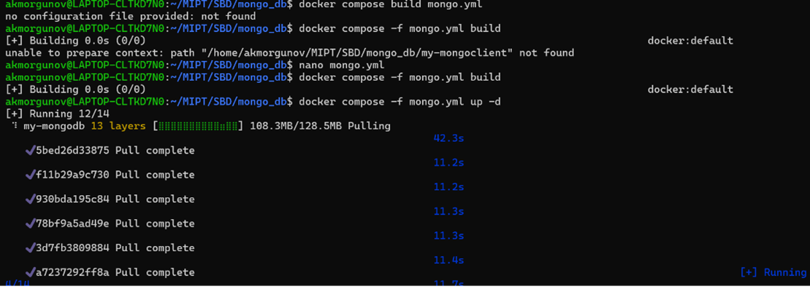
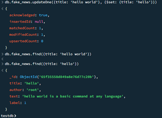

1.	Запустил mongo через docker

Запустил mongo_sh  в GUI Compass, далее все действия выполнял там

2.	Затем скачал набор данных fske_news, залил их в mongo
https://www.kaggle.com/competitions/fake-news/data

3.	Совершил над этими данными CRUD операции
Create

Read

Update

Delete

4.	Создал индексы, проверил производительность

